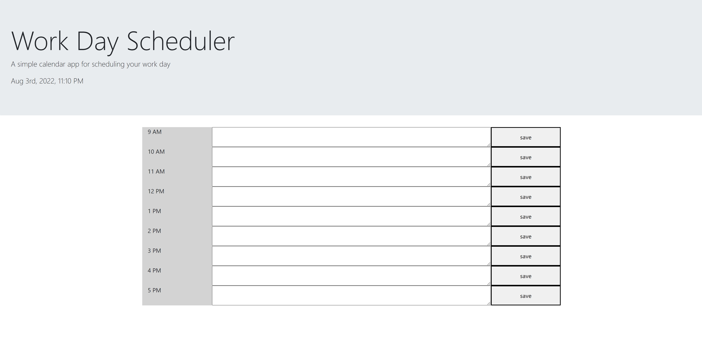

# Dynamic-Daily-Planner

## Description

This project creates a daily planner in which notes can be saved into local storage in an hourly grid. Furthermore, the planner will color coordinate each hour based on whether it is in the past, present, or future each day.

This project is built using HTML, CSS, Bootstrap, Javascript, and Jquery, featuring Moment.js heavily to get and compare the current date.

## Installation

Project can be viewed live at https://rensyphon.github.io/Dynamic-Daily-Planner/

## Usage

Click on the blank form next to desired hour, then click save to save the note to local storage.

    ```md
    
    ```

## Credits

Original code and images created by University of Arizona Full Stack Coding Boot Camp, 2022. https://bootcamp.ce.arizona.edu/coding/. This project also uses Bootstrap (https://getbootstrap.com/) as well as Moment.js (https://momentjs.com/).


